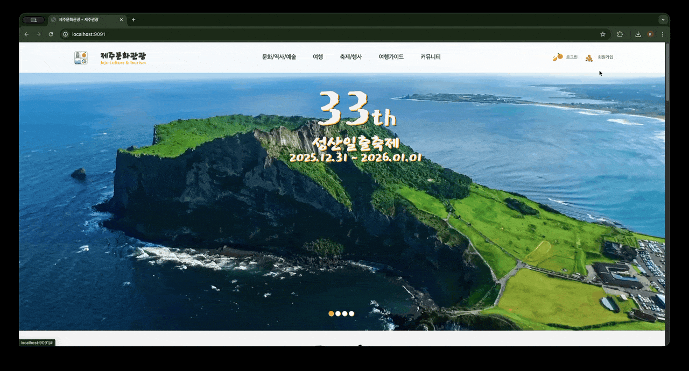
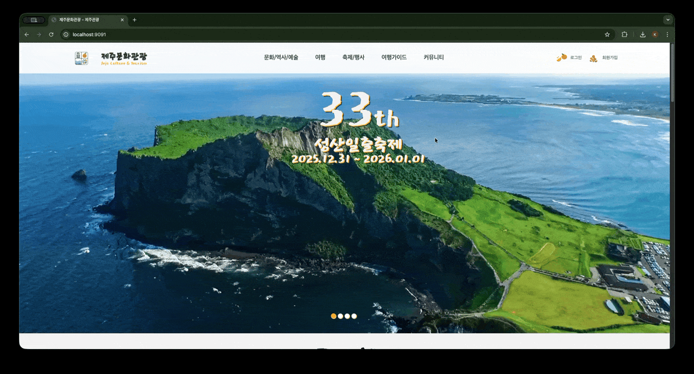
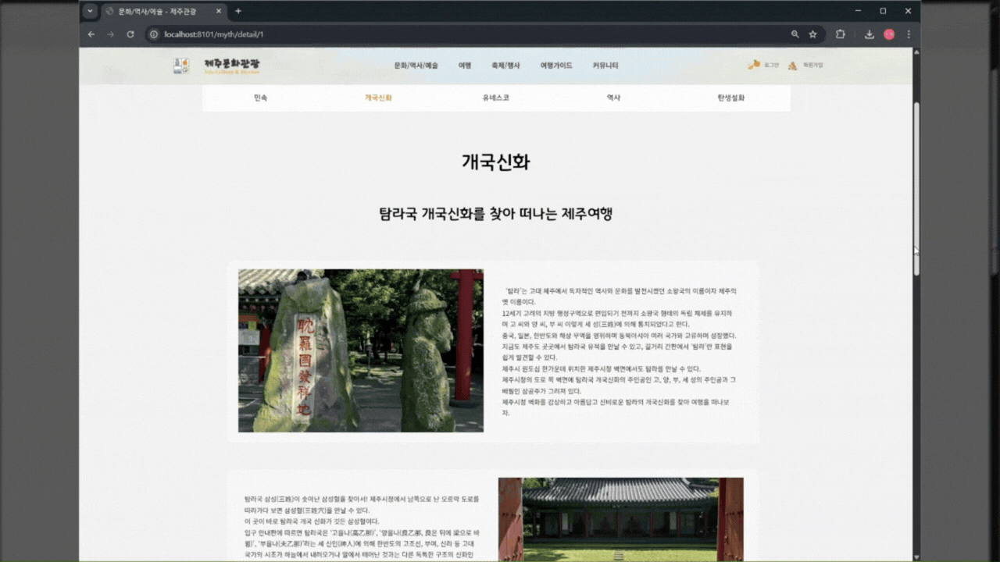
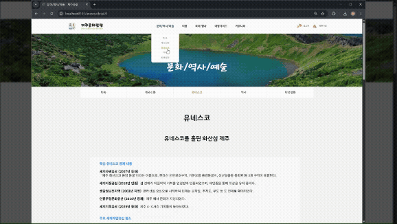
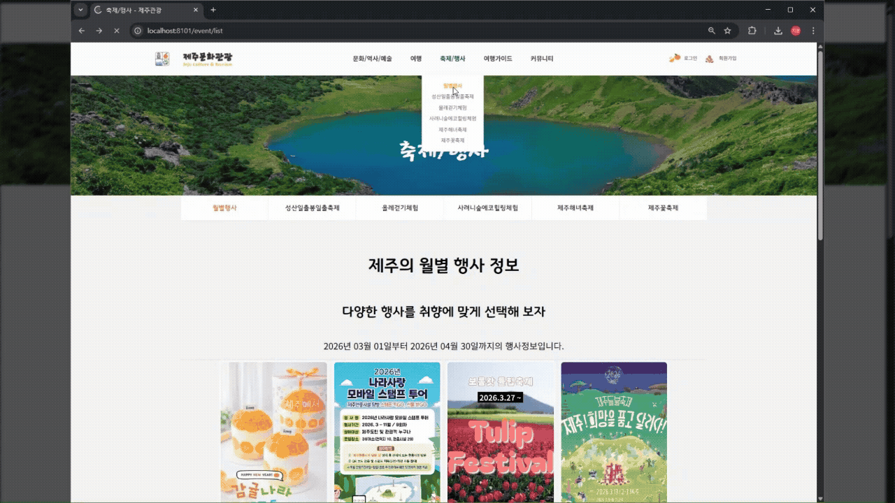

# 🌿 제주 문화관광 웹 애플리케이션

<div align="center">


> 제주도의 관광지, 문화, 축제, 숙박, 맛집 정보를 한곳에서 제공하는 웹 애플리케이션

</div>

---

## 📋 프로젝트 개요

| 항목 | 내용 |
|------|------|
| **프로젝트명** | 제주 문화관광 웹 애플리케이션 |
| **팀명** | 1팀 코딩 모코코 |
| **팀리더** | 유환희 |
| **팀원** | 유환희, 박지영, 백경서 |
| **개발 기간** | 2025 |
| **배포 환경** | Docker + PostgreSQL |

---

## 🔗 링크

| 구분 | URL |
|------|-----|
| 🌐 **프런트엔드 페이지** | [https://hwandroid921.github.io](https://hwandroid921.github.io/) |
| 💻 **GitHub (전체 소스코드)** | [https://github.com/hwandroid921/hwandroid921.github.io.git](https://github.com/hwandroid921/hwandroid921.github.io.git) |
| 📄 **산출물 (Notion)** | [프로젝트 문서](https://www.notion.so/3194fd4900b380cbbddbe3c6ddd2ed9d?source=copy_link) |
| 🐳 **Docker Image** | `olgksgml/hwandroid921:1.0` |

---

## 🛠️ 기술 스택

### Backend


### Frontend


### DevOps


---

## 📁 프로젝트 구조

```
com.tour.jeju
├── config
│   ├── FileConfig.java          # 파일 업로드 경로 설정
│   ├── WebConfig.java           # 정적 리소스 매핑
│   ├── SessionConfig.java       # 세션 설정
│   ├── PasswordEncoderConfig.java
│   └── LoginInterceptor.java    # 로그인 인증 인터셉터
├── controller
│   ├── MemberController.java
│   ├── AttractionController.java
│   ├── ReviewController.java
│   ├── AccommodationController.java
│   ├── FoodController.java
│   ├── FestivalController.java
│   ├── EventController.java
│   ├── CultureController.java
│   ├── MythController.java
│   ├── UnescoController.java
│   ├── NoticeController.java
│   ├── TourGuiderController.java
│   ├── CommunityEventController.java
│   └── ComplaintController.java
├── service          # 비즈니스 로직
├── repository       # JPA Repository
├── entity           # JPA Entity
├── dto              # Request / Response DTO
└── util
    └── FileUploadUtil.java      # 파일 업로드 유틸
```

---

## ✨ 주요 기능

### 👤 회원 관리
> 회원가입, 로그인, 세션 기반 인증, 권한(USER/ADMIN) 분리

| 회원가입 | 로그인 | 로그아웃 |
|:---:|:---:|:---:|
|  |  |  |

---

### 🏝️ 관광지 · 숙박 · 맛집
> 제주 관광지 등록/조회/수정/삭제, 썸네일 및 다중 이미지 업로드, 슬라이드 이미지, 지도 URL 연동
> 호텔/리조트/펜션/게스트하우스/민박 카테고리별 조회, 제주 대표 음식 및 맛집 소개

| 관광지 (우도) | 숙박 | 맛집 |
|:---:|:---:|:---:|
|  |  |  |

---

### 🏛️ 문화관광 · 축제 & 행사
> 제주 민속문화, 개국신화, 유네스코 세계자연유산 소개
> 제주 축제/행사 일정 및 상세 정보 제공

| 문화 | 신화 | 유네스코 | 행사 | 축제 |
|:---:|:---:|:---:|:---:|:---:|
|  |  |  |  |  |

---

### 📢 커뮤니티
> 공지사항, 여행 가이드, 커뮤니티 이벤트, 민원 게시판

| 공지사항 | 여행 후기 |
|:---:|:---:|
|  |  |

---

## 🐳 Docker 실행 방법

### 1. PostgreSQL 컨테이너 실행
```bash
docker run -d \
  --name postgres-dev \
  -e POSTGRES_PASSWORD=1004 \
  -e POSTGRES_USER=gadmin \
  -e POSTGRES_DB=shop \
  -e TZ=Asia/Seoul \
  -p 5433:5432 \
  -v postgres-data:/var/lib/postgresql/data \
  postgres:16.3
```

### 2. 애플리케이션 이미지 Pull & 실행
```bash
# 이미지 Pull
docker pull olgksgml/hwandroid921:1.0

# 컨테이너 실행
docker run -d \
  --name jeju-app \
  -p 8080:8080 \
  --link postgres-dev:postgres \
  olgksgml/hwandroid921:1.0
```

### 3. 접속
```
http://localhost:8080
```

---

## ⚙️ application.properties 설정

```properties
# DataSource
spring.datasource.url=jdbc:postgresql://localhost:5433/shop
spring.datasource.username=gadmin
spring.datasource.password=1004
spring.datasource.driver-class-name=org.postgresql.Driver

# JPA
spring.jpa.database-platform=org.hibernate.dialect.PostgreSQLDialect
spring.jpa.hibernate.ddl-auto=update
spring.jpa.show-sql=true

# Thymeleaf
spring.thymeleaf.cache=false

# File Upload
spring.servlet.multipart.max-file-size=10MB
spring.servlet.multipart.max-request-size=50MB
file.upload-dir=C:/upload/
```

---

## 🗄️ ERD 주요 관계

```
member          ──┬── notice (1:N)
                  ├── tour_guide (1:N)
                  ├── community_event (1:N)
                  ├── complaint (1:N)
                  └── review (1:N)

attraction      ──── review (1:N)
```

---

## 👥 팀원 역할

| 이름 | 역할 |
|------|------|
| **유환희** | 팀리더, 백엔드 설계, DB 설계, 인프라(Docker) |
| **박지영** | 프런트엔드 개발, UI/UX 설계 |
| **백경서** | 백엔드 개발, API 구현 |

---

## 📝 개발 규칙

- 브랜치 전략: `main` / `develop` / `feature/기능명`
- 커밋 컨벤션: `feat:`, `fix:`, `docs:`, `refactor:`
- PR 머지 전 팀원 코드 리뷰 필수

---

<div align="center">

**1팀 코딩 모코코** | 제주 문화관광 웹 애플리케이션

</div>
